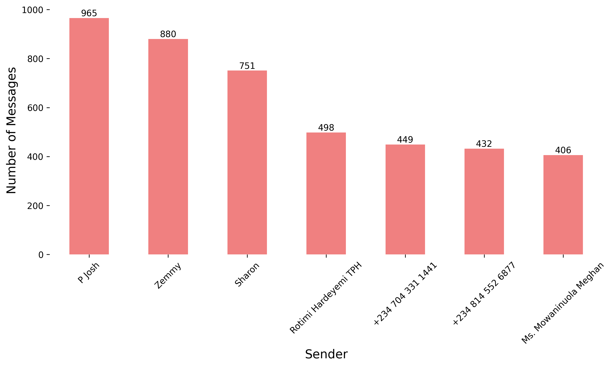
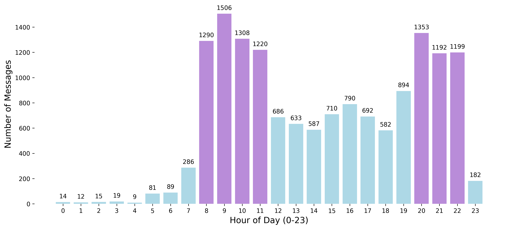

<h1 style="text-align: center;">TPH WhatsApp Group Analysis</h1>

<div align="center">
  
</div>

## Introduction: 
<details>
  <summary>Click to expand</summary>
  <br>
  
The TPH WhatsApp Group is the main online space for members of The Publishers House (TPH) — a church based at The House of Bread, Korinjoh House, Opposite Shawarma and Grills, British, Jos, Nigeria.

The group is used for:
- Sharing church updates and announcements
- Talking and staying connected with other members, leaders, and workers
- Celebrating birthdays, anniversaries, and other special moments

This project is a data analysis of the group. It looks at things like how often people chat, the most active times, what kind of messages are shared, and how people interact in the group. The goal is to better understand how the group works and how it can serve the church even more.

</details>

## Project Objective:
<details>
  <summary>Click to expand</summary>
 <br>
  
The goal of this project is to provide answers to the following questions:

- Who celebrates birthdays the most 🎉
- The most common words we use
- The emotional tone of our conversations
- Peak hours and days of message activity
- Who sends the most messages and gets the most responses
- How quickly we respond
- Who consistently engages the most
- And how many of our 274 members are active participants

It’s a look into what our group chats reveal about us as a spiritual family.
</details>

## How to Run The Source Code Locally:
<details>
  <summary>Click to expand</summary>

## Setup and Execution Instructions

### How the Data Was Collected

The dataset used for this project was exported from our church’s WhatsApp group using the **“Export Chat”** feature.

* WhatsApp generated a `.zip` file, which I downloaded.
* After extracting (unzipping) the file, I got a `.txt` file containing all the messages.
* This `.txt` file became the raw data used for analysis.

---

### Data and Configuration

You can find all the data files used in this project in the `Datasets/` directory of this repository. This folder contains:

* **TPH Data Zip File**: The raw WhatsApp export file from our church group, downloaded directly using WhatsApp's "Export Chat" feature.
* **Text File**: The `.txt` file extracted from the ZIP, which contains the raw message data. You can find it inside the Zip file folder
* **church_chat**: A processed version of the `.txt` file, converted to a structured `.csv` format using Python in Google Colab.
* **church_chat_clean**: A final, cleaned version of the data used for exploration and analysis.

These files make it easy to follow the full data journey — from raw export to structured insights.

---

### Environment Used

I didn’t run this project locally on my system. Instead:

* I used **Google Colab Notebooks** to write and run all the Python code.
* I **connected my Google Drive** to Colab so I could store files in the cloud, access the `.txt` file, and save the resulting `.csv` file.

---

### Tools & Python Libraries Used

This project was done entirely on **Google Colab**, so there was no need to install anything manually. However, here are the key tools and Python libraries used throughout the analysis:

* **Python:** The main programming language used for all tasks.
* **Pandas:** For data cleaning, manipulation, and analysis.
* **Matplotlib:** Used to create basic visualizations.
* **WordCloud:** To visualize frequently used words in the chat data.
* **Emoji:** For identifying and analyzing emojis used in messages.
* **re (Regular Expressions):** For text parsing and message formatting.
* **datetime:** For processing and analyzing timestamps.

All these libraries were either pre-installed in Colab or installed using simple pip commands like:

```python
!pip install wordcloud emoji
```

You don’t need to install these manually if you open the notebooks via Colab, they will run smoothly

---

### Project Workflow Overview

1. **Step 1 – Data Export:**
   I wrote a Colab Notebook that reads the `.txt` file (from the exported WhatsApp chat) and converts it to a well-structured `.csv` file.

2. **Step 2 – Data Analysis (EDA):**
   I created another Colab Notebook where I explored the data using Python libraries like Pandas and Matplotlib to extract insights.

---

### No Local Setup Required

Since this project was fully executed on Google Colab, you don’t need to install Python, Jupyter, or VS Code to run it.

Just click the links below to view or run the notebooks:

* [CSV Export Notebook](https://colab.research.google.com/drive/1Xm2DTMFDKssWEBw_G2vNj87WNqrs-dar?usp=sharing)
* [EDA & Analysis Notebook](https://colab.research.google.com/drive/1HrQmWLhFgt9AD4Jt6CpVG5xRp872bGYB?usp=sharing)

---
  
</details>

## Exploratory Data Analysis (EDA) & Insights
<details>
  <summary>Click to expand</summary>
  <br>

### Dataset Overview

* **Date Range:** December 11, 2024 — April 19, 2025
* **Original Dataset Shape:** 18,827 rows × 4 columns
* **Cleaned Dataset Shape:** 15,349 rows × 4 columns
* **Columns:**

  * `Date` – datetime format for daily trend tracking
  * `Time` – datetime format for hourly analysis
  * `Sender` – name or number of message sender
  * `Message` – actual text content

### Cleaning Process

* Removed rows with:

  * `Media omitted` or system notifications (e.g., "You added XYZ")
  * Empty or null messages
* Kept all columns — each is essential for the analysis
* No irrelevant columns found

---

## Key Questions & Insights

### 1. **Most Common Messages**

It is visually clear that ‘Happy Birthday’, ‘birthday sir/ma’, ‘God bless’, and ‘prayer’ dominate the conversations as seen below.
 

> **Insight:** This group is celebratory, polite, and structured — honorifics like *ma* and *sir* are frequently used. This shows our group’s strong culture of celebration, encouragement, and spiritual connection.


---

### 2. **Birthday Wish Culture**

* **Total birthday-related messages:** 3,205 (out of 15,349)
* **Top Birthday Wishers:**

  * Patricia Osifo – 76
  * ThankGod Watsawda – 74
  * Sally TPH – 68
  * Maram Mary – 68
  * Okoko Lawrencia – 65 as seen below
 
    

> Patricia is the most enthusiastic birthday celebrator in the group.

---

### 3. **Weekly Activity Trends**

 

> **Insight:** Midweek (especially Wednesdays) is the group’s peak for engagement.

---

### 4. **Top Contributors**

| Sender                 | Messages   |
| ---------------------- | ---------- |
| P Josh                 | 965        |
| Zemmy                  | 880        |
| Sharon                 | 751        |
| Rotimi Hardeyemi TPH   | 498        |
| Pope Delvan      | 449        |
| Genesis      | 432        |
| Ms. Mowaninuola Meghan | 406      ✅ |



The group has a core of highly active participants who drive conversations. Dr. Josh, Zemnaan, and Sharon stand out for their consistent engagement on the group over the last four months. It's also encouraging to see other contributors like Rotimi, Pope Delvan(449), Genesis (432), etc.

---

### 5. **Sentiment & Tone Analysis**

| Tone     | % of Messages | Interpretation                          |
| -------- | ------------- | --------------------------------------- |
| Neutral  | 61.08%        | Coordination, planning, casual banter   |
| Positive | 36.05%        | Birthday wishes, prayers, encouragement |
| Negative | 2.87%         | Mostly teasing or light sarcasm         |


> The group culture is **joyful, supportive, and honor-driven**, with almost no hostility.

---

### 6. **Response Time & Engagement**

* **Median Response Time:** 0.00 minutes
* **Average Response Time:** 13.48 minutes

> This means that most members reply almost immediately, showing that the group is very active and quick to respond. A few slower replies increase the average to 13 minutes, but overall, the group chats are lively and responsive.

---

### 7. **Member Participation**

* **Total Members:** 274
* **Active Senders:** 231 (84.31%)
* **Inactive Members:** 43 (15.69%)


> **High Engagement:** More than 8 in 10 members actively participate — a strong, healthy community.

---

### 8. **Message Activity By Hour Of The Day**



This chart shows the hours when we talk the most, morning (8 AM–11 AM) and evening (8 PM–10 PM). Purple bars highlight the top 7 most active hours, while blue bars show the quieter times.

---

## Summary

**What This Data Tells Us**

* This WhatsApp group thrives on **celebration, honor, and encouragement.**
* Most interactions are **positive or neutral**, with **almost no negativity** or toxicity.
* The group is **fast-paced**, with instant replies and high participation.
* Members **respect and appreciate each other**, evident from greetings, honorifics, and uplifting messages.

> If community health could be measured in chats, this group scores **extremely high** — a model for joyful digital communities.
</details>

## 📊 Final Report  
Download the full PowerPoint presentation made to my church [here](TPH Data Analysis Report.pptx).

Absolutely, Mowa. Here's a polished **"Feedback from Stakeholders"** section you can copy into your `README.md` file, with grouped and organized highlights for clarity and professionalism:

---

### 🗣️ Feedback from Stakeholders
<details>
  <summary>Click to expand</summary>
 <br> 

Here are some reviews and comments received from TPH members and leaders after sharing the WhatsApp Group Data Analysis report:

#### **General Feedback**

* *"This is an interesting read. Well done."* — **Victoria TPH**, **Pst. Dami**, **Dr. David Ochogbe**
* *"Well done ma."* — **GPD**, **Taye**, **Rotimi TPH**, **Uncle Tim**
* *"Nice work sis."* — **Davou**, **Wisdom Juliet**, **Isaac**
* *"Great job, Mowa!"* — **Salamatu TPH**
* *"Really beautiful, thank you ma."* — **Shalom TPH**
* *"This is so good. Visually appealing. Very professional."* — **KC**
* *"Outstanding work. I couldn’t look away!"* — **The Love Odeh**
* *"This is so concise and profound."* — **Ibflame**
* *"Amazing stuff."* — **+234 811 968 8252**
* *"Thank you so much Ma. I love this!"* — **Tinaobiye**

#### **Engagement & Humor**

* *"The analysis actually Dae on Point!"* — **Jaay**
* *"I had a smile on my face from start to finish."* — **Shalom TPH**
* *"More birthdays to celebrate!"* — **Mr. Watsawda TPH**
* *"How did my name enter your analytics report?"* — **Patricia Osifo Media**
* *"I see why this message came by 8am."* — **Jaay**

#### **Professional Remarks**

* *"The data was concise, and I love your recommendation at the end."* — **Sharon Black**
* *"I saw trends I had noticed and even new ones."* — **Patricia Osifo Media**
* *"It's actually a good one. Thank you."* — **Oma TPH**
* *"This is an interesting and insightful work I must say. Good job!"* — **Uncle Tim**
* *"Quite insightful."* — **+234 814 476 7945**

#### **Pastoral Feedback**

* *"Wow. This is really insightful. Do you want to share with the group?"* — **My Daddy TPH**
* *"Go ahead please. Well done."* — **My Daddy TPH**
* *"Kudos sis. The data expert in the biubui!"* — **My Mummy Mrs T**

#### **Inquiries**

* *"I didn’t see the code on your repo..."* — **Ogbuti**
* *"Where did you get the data? Was it exported from the group?"* — **Patricia Osifo Media**
* *"Also really interested in the code too."* — **Patricia Osifo Media**

---
</details>
## Recommendations & Conclusions:
<details>
  <summary>Click to expand</summary>
 <br>  

This is not a business report, and that’s why I’m not making any formal suggestions or including a “Recommendations” section. However, we can consider doing the following:

1. Make use of Best Times to Post
Schedule important announcements or discussions between 8–11 AM or 8–10 PM, especially midweek.
Avoid Mondays for heavy posts since it’s the quietest.

2. Encourage Fast, Responsive Culture
The median reply time is 0 mins. Excellent!
Let’s preserve this by discouraging ghosting and thanking people for responding quickly.

Overall, this analysis provided a clear view of how the TPH WhatsApp group engages over time. From top contributors to peak activity periods, the data reflects the life and rhythm of our community.

It’s a beautiful reminder that what goes on, on the group matters.

</details>

## Thank you for reading! 😊
You can reach me on +234 9056 1876 (WhatsApp only)

